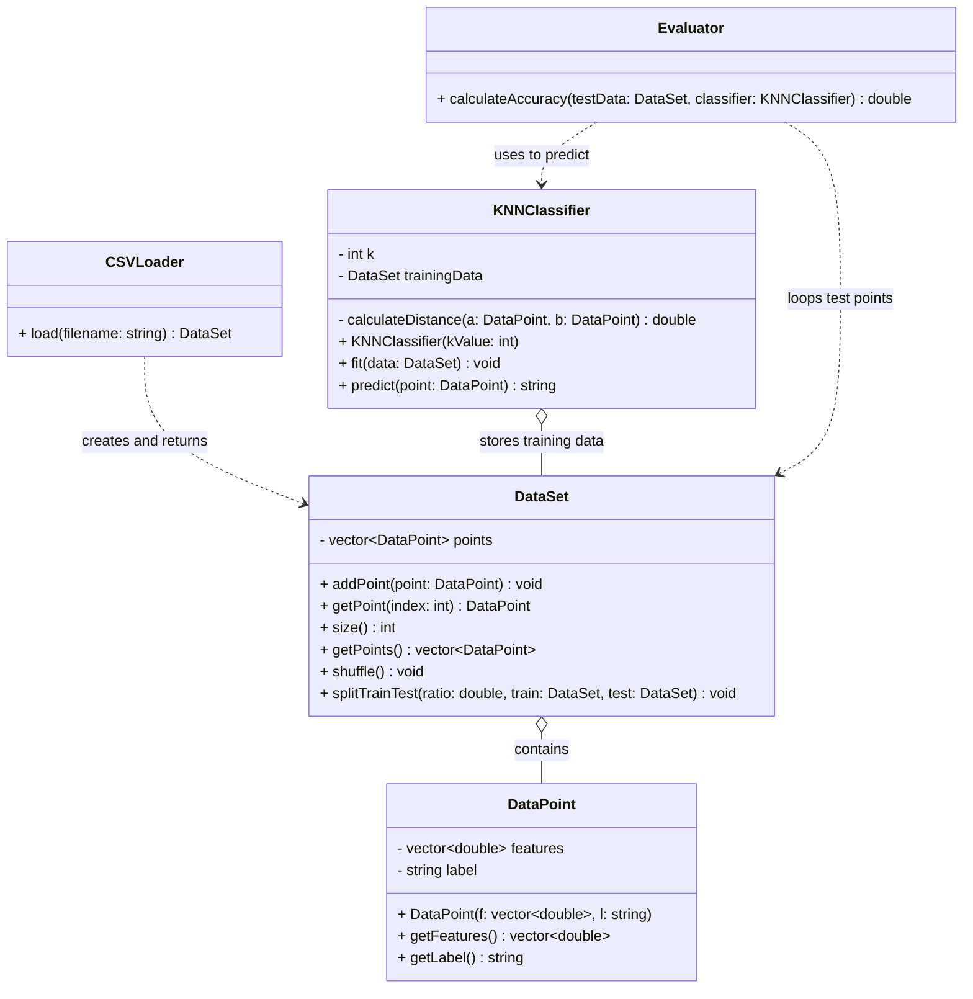
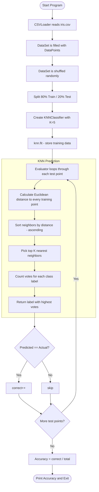

# UML Class Diagram

```mermaid
classDiagram
    class DataPoint {
        - vector~double~ features
        - string label
        + DataPoint(f: vector~double~, l: string)
        + getFeatures() vector~double~
        + getLabel() string
    }

    class DataSet {
        - vector~DataPoint~ points
        + addPoint(point: DataPoint) void
        + getPoint(index: int) DataPoint
        + size() int
        + getPoints() vector~DataPoint~
        + shuffle() void
        + splitTrainTest(ratio: double, train: DataSet, test: DataSet) void
    }

    class CSVLoader {
        + load(filename: string) DataSet
    }

    class KNNClassifier {
        - int k
        - DataSet trainingData
        - calculateDistance(a: DataPoint, b: DataPoint) double
        + KNNClassifier(kValue: int)
        + fit(data: DataSet) void
        + predict(point: DataPoint) string
    }

    class Evaluator {
        + calculateAccuracy(testData: DataSet, classifier: KNNClassifier) double
    }

    DataSet o-- DataPoint : contains
    CSVLoader ..> DataSet : creates and returns
    KNNClassifier o-- DataSet : stores training data
    Evaluator ..> KNNClassifier : uses to predict
    Evaluator ..> DataSet : loops test points
```

---

# Program Flowchart

```mermaid
flowchart TD
    A([Start Program]) --> B[CSVLoader reads iris.csv]
    B --> C[DataSet is filled with DataPoints]
    C --> D[DataSet is shuffled randomly]
    D --> E[Split 80% Train / 20% Test]

    E --> F[Create KNNClassifier with K=5]
    F --> G[knn.fit - store training data]

    G --> H[Evaluator loops through each test point]

    subgraph KNN Prediction
        H --> I[Calculate Euclidean distance to every training point]
        I --> J[Sort neighbors by distance - ascending]
        J --> K[Pick top K nearest neighbors]
        K --> L[Count votes for each class label]
        L --> M[Return label with highest votes]
    end

    M --> N{Predicted == Actual?}
    N -->|Yes| O[correct++]
    N -->|No| P[skip]
    O --> Q{More test points?}
    P --> Q
    Q -->|Yes| H
    Q -->|No| R[Accuracy = correct / total]
    R --> S([Print Accuracy and Exit])
```
