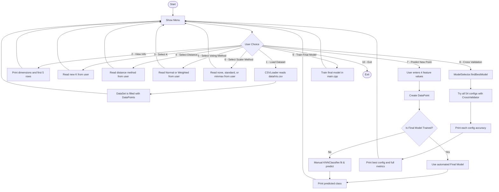

# UML Class Diagram and Program Flow

## UML Class Diagram

```mermaid
classDiagram
    class DataPoint {
        - vector~double~ features
        - string label
        + DataPoint(f: vector~double~, l: string)
        + getFeatures() vector~double~
        + getLabel() string
    }

    class DataSet {
        - vector~DataPoint~ points
        + addPoint(p: DataPoint) void
        + getPoint(index: int) DataPoint
        + size() int
        + getPoints() vector~DataPoint~
        + shuffle(seed: int) void
        + splitTrainTest(train: DataSet, test: DataSet, ratio: double) void
    }

    class CSVLoader {
        + load(filename: string) DataSet
    }

    class IDistance {
        <<abstract>>
        + calculate(a: DataPoint, b: DataPoint) double
    }

    class EuclideanDistance {
        + calculate(a: DataPoint, b: DataPoint) double
    }

    class ManhattanDistance {
        + calculate(a: DataPoint, b: DataPoint) double
    }

    class MinkowskiDistance {
        - double p
        + MinkowskiDistance(p: double)
        + calculate(a: DataPoint, b: DataPoint) double
    }

    class IScaler {
        <<abstract>>
        + fit(data: DataSet) void
        + transform(point: DataPoint) DataPoint
    }

    class StandardScaler {
        - vector~double~ mean
        - vector~double~ stdDev
        + fit(data: DataSet) void
        + transform(point: DataPoint) DataPoint
    }

    class MinMaxScaler {
        - vector~double~ minValues
        - vector~double~ maxValues
        + fit(data: DataSet) void
        + transform(point: DataPoint) DataPoint
    }

    class KNNClassifier {
        - int k
        - IDistance* distanceMetric
        - bool weighted
        - DataSet trainingData
        + KNNClassifier(k: int, metric: IDistance*, weighted: bool)
        + fit(data: DataSet) void
        + predict(point: DataPoint) string
    }

    class Evaluator {
        + calculateAccuracy(actual: vector~string~, predicted: vector~string~) double
        + printConfusionMatrix(actual: vector~string~, predicted: vector~string~) void
        + printPrecision(actual: vector~string~, predicted: vector~string~) void
        + printRecall(actual: vector~string~, predicted: vector~string~) void
        + printF1Score(actual: vector~string~, predicted: vector~string~) void
    }

    class ModelConfig {
        + int k
        + string distanceType
        + string scalerType
        + bool weighted
    }

    class ModelResult {
        + ModelConfig config
        + vector~double~ foldAccuracies
        + double averageAccuracy
    }

    class CrossValidator {
        + evaluate(data: DataSet, config: ModelConfig, folds: int) ModelResult
    }

    class ModelSelector {
        + findBestModel(data: DataSet) ModelConfig
    }

    DataSet "1" o-- "many" DataPoint : contains
    CSVLoader --> DataSet : creates

    IDistance <|-- EuclideanDistance : inherits
    IDistance <|-- ManhattanDistance : inherits
    IDistance <|-- MinkowskiDistance : inherits

    IScaler <|-- StandardScaler : inherits
    IScaler <|-- MinMaxScaler : inherits

    KNNClassifier --> IDistance : uses
    KNNClassifier o-- DataSet : stores training data

    CrossValidator --> KNNClassifier : creates and uses
    CrossValidator --> Evaluator : uses
    CrossValidator --> IScaler : uses
    CrossValidator --> ModelConfig : takes as input
    CrossValidator --> ModelResult : returns

    ModelSelector --> CrossValidator : calls evaluate
    ModelSelector --> ModelConfig : returns best

```



---

## Program Flowchart



---

## How Data Flows Through the Project

```
iris.csv
   ↓
CSVLoader → DataSet (150 DataPoints)
   ↓
ModelSelector
   ↓ tries 54 combinations of K, distance, scaler, weighted
CrossValidator (5-Fold)
   ↓ for each fold: trains KNNClassifier, checks accuracy
Evaluator → prints confusion matrix, precision, recall, F1
   ↓
Best ModelConfig
   ↓
main.cpp → trains on ALL 150 points → ready to predict new data
```
