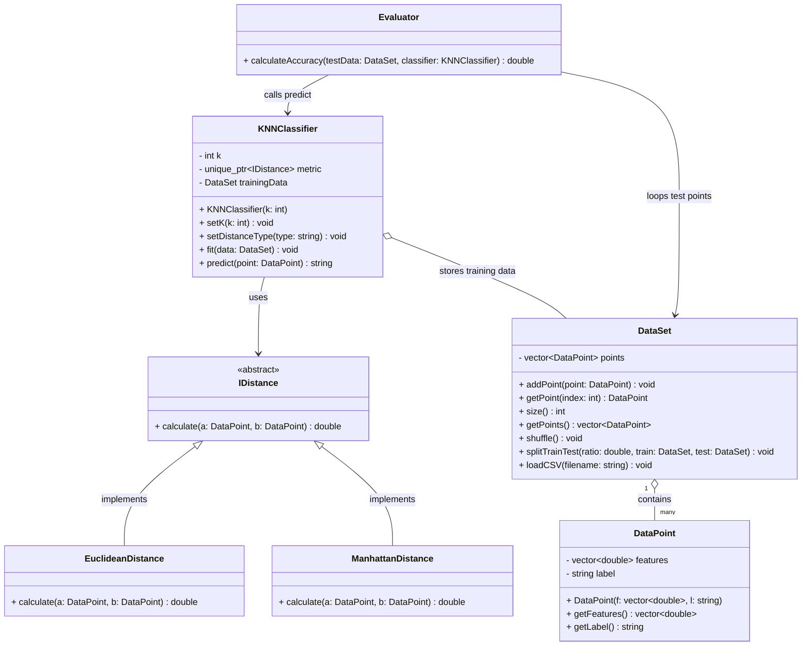
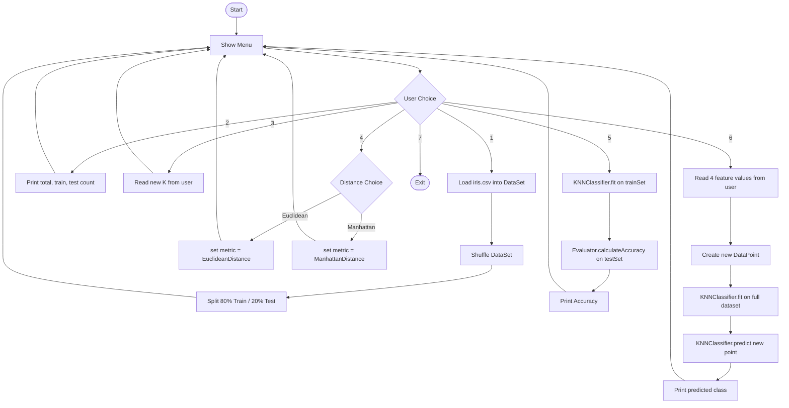

# UML Class Diagram and Program Flow

## UML Class Diagram

```mermaid
classDiagram
    class DataPoint {
        - vector~double~ features
        - string label
        + DataPoint(f: vector~double~, l: string)
        + getFeatures() vector~double~
        + getLabel() string
    }

    class DataSet {
        - vector~DataPoint~ points
        + addPoint(point: DataPoint) void
        + getPoint(index: int) DataPoint
        + size() int
        + getPoints() vector~DataPoint~
        + shuffle() void
        + splitTrainTest(ratio: double, train: DataSet, test: DataSet) void
        + loadCSV(filename: string) void
    }

    class IDistance {
        <<abstract>>
        + calculate(a: DataPoint, b: DataPoint) double
    }

    class EuclideanDistance {
        + calculate(a: DataPoint, b: DataPoint) double
    }

    class ManhattanDistance {
        + calculate(a: DataPoint, b: DataPoint) double
    }

    class KNNClassifier {
        - int k
        - unique_ptr~IDistance~ metric
        - DataSet trainingData
        + KNNClassifier(k: int)
        + setK(k: int) void
        + setDistanceType(type: string) void
        + fit(data: DataSet) void
        + predict(point: DataPoint) string
    }

    class Evaluator {
        + calculateAccuracy(testData: DataSet, classifier: KNNClassifier) double
    }

    DataSet "1" o-- "many" DataPoint : contains
    IDistance <|-- EuclideanDistance : implements
    IDistance <|-- ManhattanDistance : implements
    KNNClassifier --> IDistance : uses
    KNNClassifier o-- DataSet : stores training data
    Evaluator --> KNNClassifier : calls predict
    Evaluator --> DataSet : loops test points
```

---

## Program Flowchart

```mermaid
flowchart TD
    A([Start]) --> B[Show Menu]
    B --> C{User Choice}

    C -->|1| D[Load iris.csv into DataSet]
    D --> E[Shuffle DataSet]
    E --> F[Split 80% Train / 20% Test]
    F --> B

    C -->|2| G[Print total, train, test count]
    G --> B

    C -->|3| H[Read new K from user]
    H --> B

    C -->|4| I{Distance Choice}
    I -->|Euclidean| J[set metric = EuclideanDistance]
    I -->|Manhattan| K[set metric = ManhattanDistance]
    J --> B
    K --> B

    C -->|5| L[KNNClassifier.fit on trainSet]
    L --> M[Evaluator.calculateAccuracy on testSet]
    M --> N[Print Accuracy]
    N --> B

    C -->|6| O[Read 4 feature values from user]
    O --> P[Create new DataPoint]
    P --> Q[KNNClassifier.fit on full dataset]
    Q --> R[KNNClassifier.predict new point]
    R --> S[Print predicted class]
    S --> B

    C -->|7| T([Exit])
```
